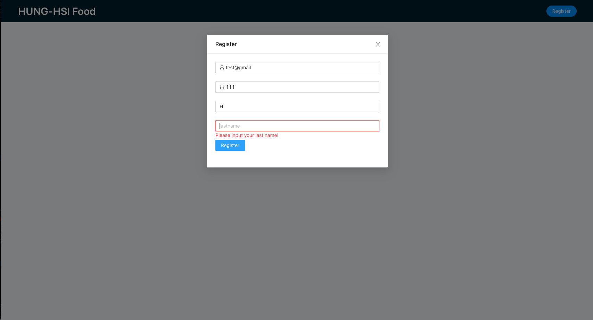
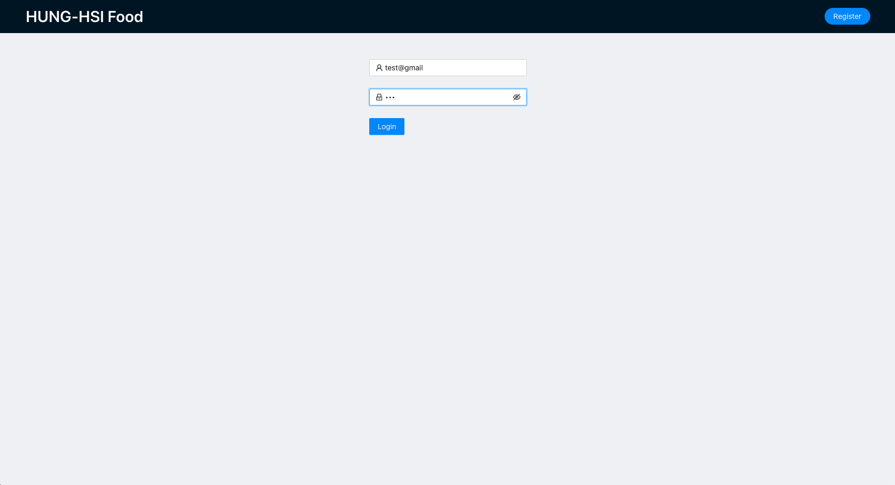
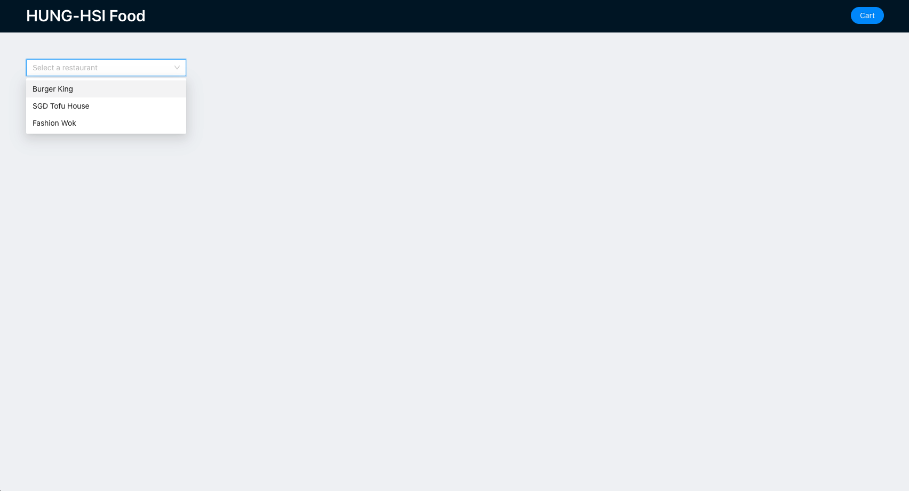
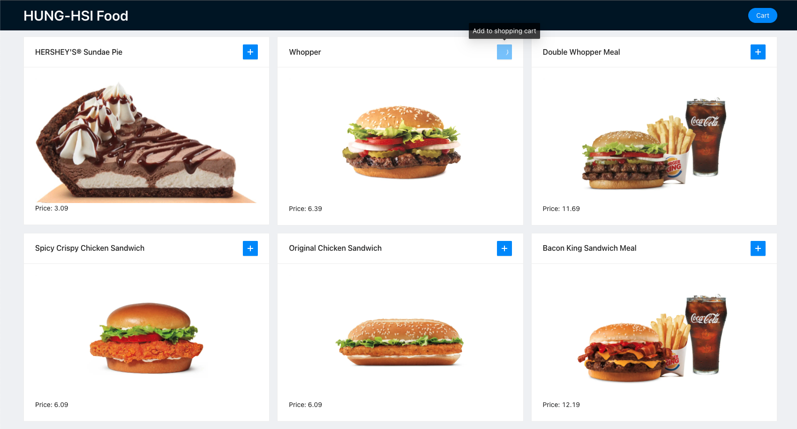
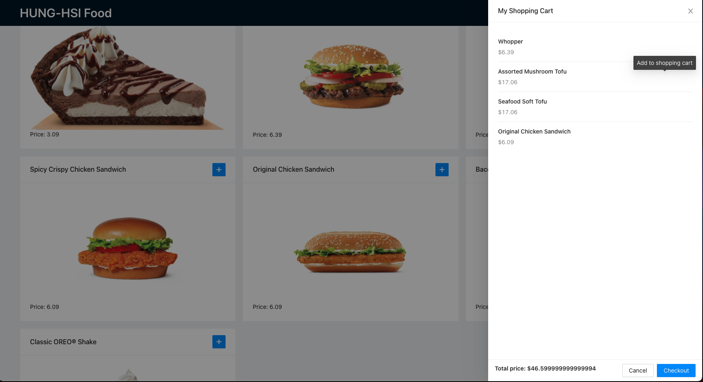

# Create a food ordering website

This project was bootstrapped with [Create React App](https://github.com/facebook/create-react-app). Front-end paprt is implemented by Javascript, CSS, html and React, backend is execued in Java environment, with assistance of libraries of Spring framework, Hibernate and Tomcat. 

---

## How to run the project to launch the website
1. Set the application server to be Tomcat > 9.0 versioin.

2. Front-end code is already packed in src/main/webapp folder, so the website will start automatically as running the package. 

3. The data (e.g., restaurant, menu, food, price) are stored and import to [Amazon relational database service (RDS)](https://aws.amazon.com/rds/), please create your own RDS and import the data. Don't forget to change the url in the file to connect to your won database.

4. Run Tomcat, wait for couple of minutes to have the project built.

5. At your browser, enter http://localhost:8080/ to connect to the website, and you will see the home page

---

## What can we do on this website

1. At first page, please enter the account and passwod for log in. If it's your first time visiting the website, please hit *Register* button on top-right corner

2. Enter the information about your account, please note that error might pop-up if the content does not meet requirements.

3. After registration, you should be able to get back to home page, then enter your registered account and password. Hit the eyeball could show the password you entered.

4. Then there will be restarants to be selected, in this project, information of 3 restaurants were imported.

5. Select one of restaurant, the corresponding menu should appears.

6. You could hit the *plus* button to add food into cart, you should be able to see the button shows pending after hitting the object

7. Hit the top-right *Cart* button, you should be able to see the food you ordered and how much should be paid. If you press checkout, then the cart will be cleared and information should show "successful payment was made".

8. Enjoy your food!

